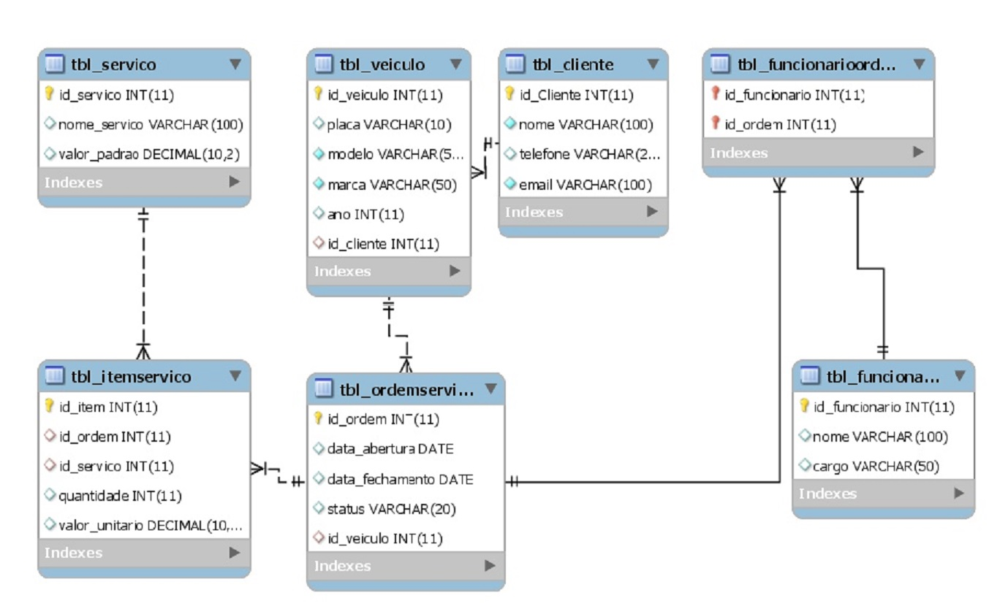

# Sistema de Oficina Mecânica 🚗🔧

Este projeto tem como objetivo representar o modelo lógico e físico de um sistema de gestão de uma oficina mecânica. Ele foi desenvolvido a partir de um modelo conceitual utilizando o modelo Entidade-Relacionamento (ER) e convertido para um modelo relacional em SQL.

## 🎯 Funcionalidades

- Cadastro de clientes, veículos, ordens de serviço e funcionários
- Lançamento de serviços prestados e itens de ordem
- Relatórios de gastos e atendimentos
- Consultas complexas utilizando SQL

## 🧱 Estrutura do Banco

- **bd_oficina**: Banco de Dados da oficina
  - **tbl_cliente**: armazena dados dos clientes.
  - **tbl_veiculo**: veículos cadastrados por cliente.
  - **tbl_servico**: tipos de serviço com valor padrão.
  - **tbl_ordemservico**: ordens abertas para veículos.
  - **tbl_itemservico**: serviços executados por ordem.
  - **tbl_funcionario**: funcionários da oficina.
  - **tbl_funcionarioordem**: tabela associativa N:N entre funcionário e ordem.

## 📦 Estrutura

- Script de criação do banco e das tabelas (CREATE TABLE)
- Inserção de dados para testes (INSERT)
- Consultas SQL com SELECT, JOIN, WHERE, HAVING, ORDER BY e expressões

## 🛠️ Tecnologias

- [PostgreSQL]() / [MySQL](https://dev.mysql.com/downloads/workbench/)
- SQL Puro
- Git + GitHub

## 📊 Exemplos de Consultas

- Listar ordens finalizadas
- Calcular valor total por item e por ordem
- Relacionar cliente, veículo e ordens
- Listar funcionários por ordem de serviço
- Agrupar ordens com valores acima de R$100

## 📁 Como usar

1. Clone este repositório
2. Execute o script SQL no seu gerenciador de banco
3. Teste as queries descritas na pasta `/queries`

---

Desenvolvido como desafio para avaliação de conhecimentos em modelagem de banco de dados e SQL.
